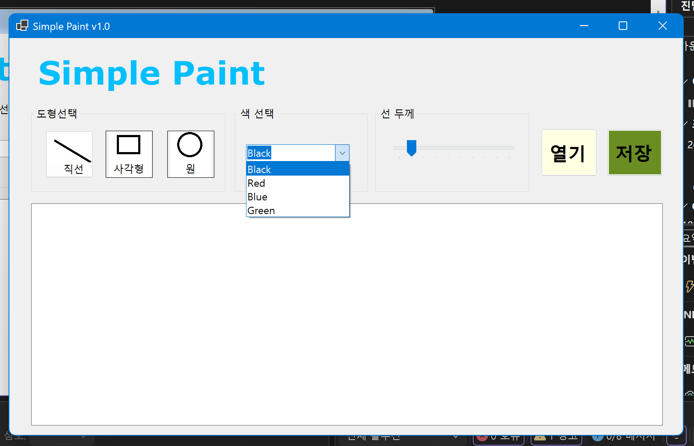
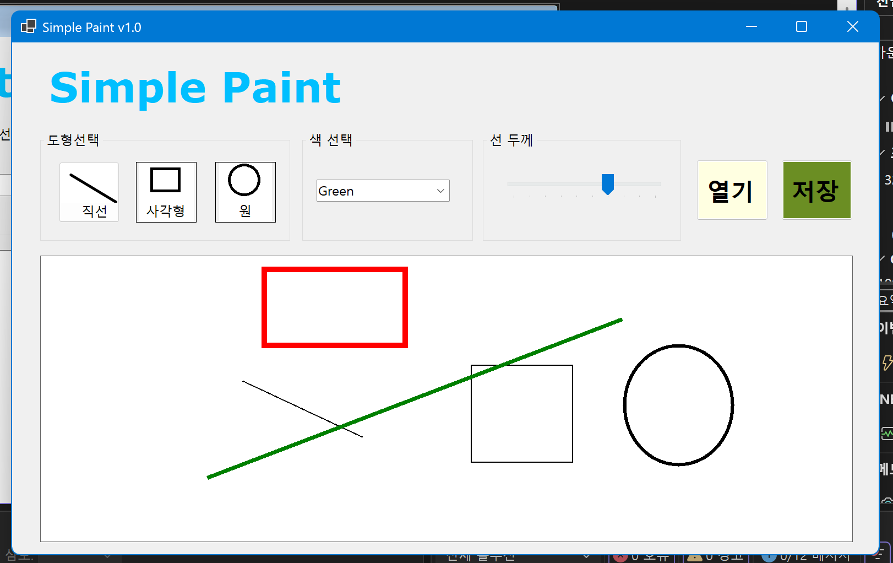
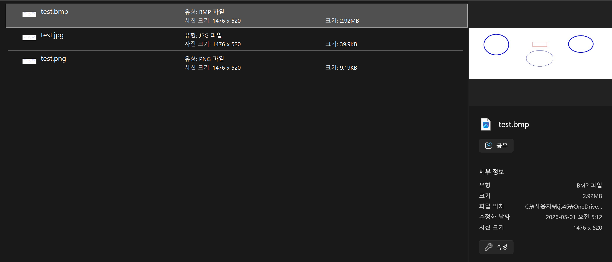
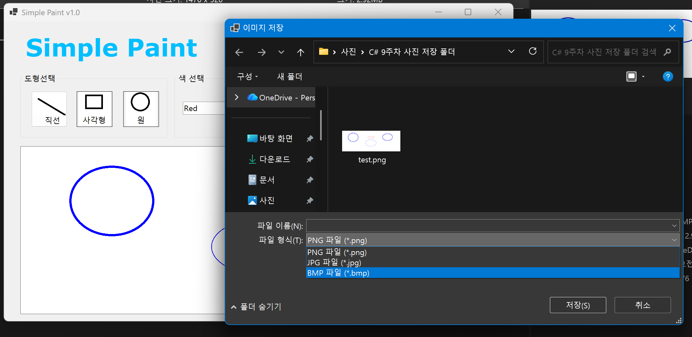
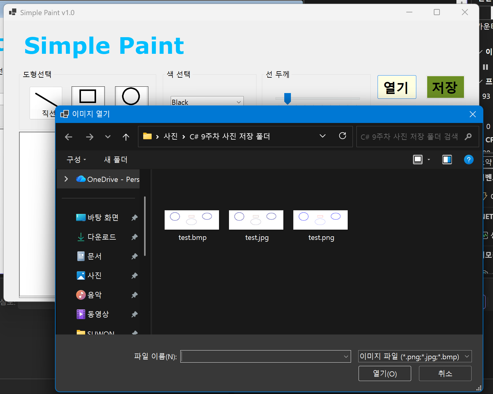
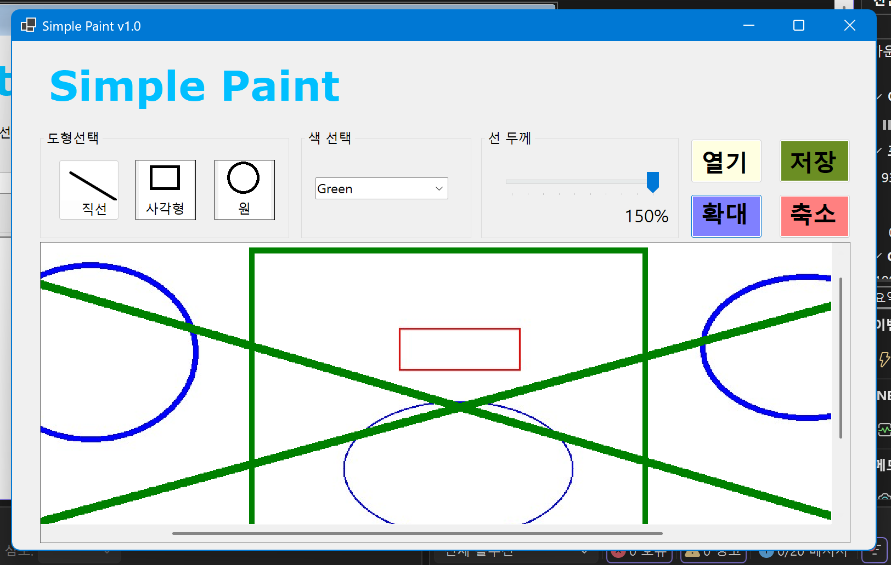
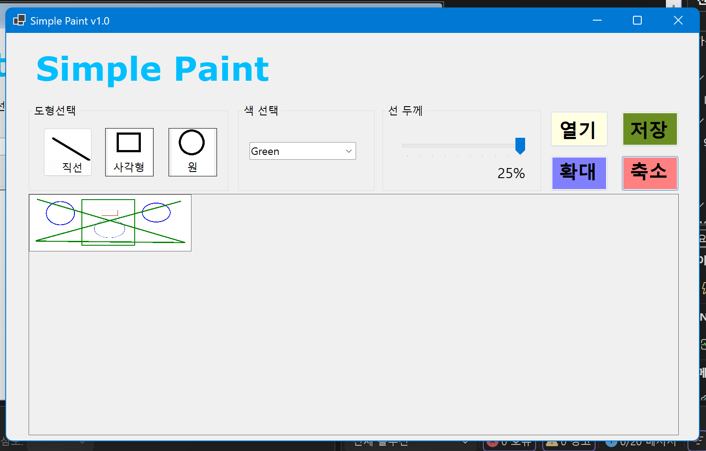

# (C# 코딩) Simple Paint

## 개요
  - C# 프로그래밍 학습을 위해 Windows Forms로 구현한 그림판(Simple Paint) 프로그램입니다.
  - 1줄 소개: 직선, 사각형, 원을 그리고 색상과 선 두께를 선택할 수 있으며, 외부 이미지를 불러와 그 위에 그림을 그린 뒤 저장할 수 있는 그림판 앱입니다.

- 사용한 플랫폼:
  - C#
  - .NET Windows Forms
  - Visual Studio
  - GitHub

- 사용한 컨트롤:
  - Label
  - GroupBox
  - Button
  - ComboBox
  - TrackBar
  - PictureBox
  - Panel
  - OpenFileDialog
  - SaveFileDialog

- 사용한 기술과 구현한 기능:
  - Bitmap 객체를 캔버스로 사용하여 실제 그림 데이터가 메모리에 저장되도록 구현하였습니다.
  - Graphics 객체를 이용하여 Bitmap 위에 직선, 사각형, 원을 그릴 수 있도록 구현하였습니다.
  - PictureBox를 그림이 표시되는 화면으로 사용하고 Paint 이벤트를 통해 캔버스를 출력하도록 구성하였습니다.
  - MouseDown, MouseMove, MouseUp 이벤트를 이용하여 마우스 드래그 기반의 그림 그리기를 구현하였습니다.
  - 드래그 중에는 점선 스타일의 미리보기 도형이 보이도록 처리하였습니다.
  - ComboBox를 이용해 검정, 빨강, 파랑, 녹색 중 하나의 색상을 선택할 수 있도록 구현하였습니다.
  - TrackBar를 이용해 선 두께를 1~10 범위에서 조절할 수 있도록 구현하였습니다.
  - SaveFileDialog를 사용하여 그려진 그림을 PNG, JPG, BMP 형식으로 저장할 수 있도록 구현하였습니다.
  - OpenFileDialog를 사용하여 외부 이미지 파일을 불러오고, 해당 이미지를 새로운 캔버스로 사용할 수 있도록 구현하였습니다.
  - 불러온 이미지 크기에 맞춰 PictureBox와 캔버스 크기를 조정하도록 구현하였습니다.
  - Panel의 AutoScroll 기능을 이용하여 큰 이미지가 들어온 경우 스크롤하면서 볼 수 있도록 구성하였습니다.
  - 확대 버튼과 축소 버튼을 사용해 이미지 배율을 조절할 수 있도록 구현하였습니다.
  - 배율이 변경되어도 마우스 좌표를 원본 캔버스 좌표로 변환하여 정확한 위치에 도형이 그려지도록 구현하였습니다.
  - 현재 배율을 Label에 퍼센트 형태로 표시하도록 구성하였습니다.

- 화면 구성:
  - 상단에는 앱 이름을 표시하는 Label을 배치하였습니다.
  - 좌측에는 도형 선택용 GroupBox를 두고 직선, 사각형, 원 버튼을 배치하였습니다.
  - 가운데에는 색상 선택용 ComboBox와 선 두께 조절용 TrackBar를 배치하였습니다.
  - 우측에는 열기, 저장, 확대, 축소 버튼과 배율 표시 Label을 배치하였습니다.
  - 하단에는 그림이 표시되는 PictureBox를 Panel 안에 배치하여 큰 이미지를 스크롤하면서 볼 수 있도록 구성하였습니다.

## 실행 화면 (과제1)
  - 과제1 코드의 실행 스크린샷
  

- 과제 내용
  - 기본 UI 배치와 컨트롤 이름 설정을 완료하고, 도형 선택, 색상 선택, 선 두께 선택 기능을 구현하였습니다.
  - Label, GroupBox, Button, ComboBox, TrackBar, PictureBox를 이용하여 그림판 화면을 구성하였습니다.

- 구현 내용과 기능 설명
  - 앱 제목을 표시하는 Label을 상단에 배치하였습니다.
  - 도형 선택용 GroupBox 안에 직선, 사각형, 원 버튼을 배치하였습니다.
  - 색상 선택용 ComboBox에 Black, Red, Blue, Green 항목을 추가하였습니다.
  - 선 두께 선택용 TrackBar를 1~10 범위로 설정하였습니다.
  - Bitmap과 Graphics를 이용하여 흰색 캔버스를 초기화하고 PictureBox에 표시될 준비를 완료하였습니다.
  - 직선, 사각형, 원 버튼 클릭 시 현재 도형 모드가 변경되도록 구현하였습니다.
  - ComboBox 선택에 따라 현재 색상이 변경되도록 구현하였습니다.
  - TrackBar 값 변경에 따라 현재 선 두께가 변경되도록 구현하였습니다.

## 실행 화면 (과제2)
  - 과제2 코드의 실행 스크린샷
  

- 과제 내용
  - 마우스 드래그를 이용하여 직선, 사각형, 원을 그릴 수 있도록 구현하였습니다.
  - 드래그 중에는 점선 형태의 미리보기가 표시되고, 마우스를 놓으면 실제 그림이 확정되도록 구현하였습니다.

- 구현 내용과 기능 설명
  - PictureBox의 MouseDown 이벤트에서 드래그 시작 상태와 시작 좌표를 저장하도록 구현하였습니다.
  - MouseMove 이벤트에서 현재 마우스 위치를 갱신하고 화면을 다시 그리도록 처리하였습니다.
  - MouseUp 이벤트에서 드래그를 종료하고 선택된 도형을 실제 Bitmap 캔버스에 그리도록 구현하였습니다.
  - Paint 이벤트를 이용해 드래그 중인 도형을 점선으로 미리보기 표시하도록 구현하였습니다.
  - DrawShape 공통 함수를 사용하여 현재 선택된 도형 종류에 따라 직선, 사각형, 원을 그리도록 구성하였습니다.
  - GetRectangle 함수를 사용하여 어느 방향으로 드래그해도 사각형과 원이 정상적으로 그려지도록 처리하였습니다.
  - 선택한 색상과 선 두께가 실제 그림 결과에 반영되도록 구현하였습니다.

## 실행 화면 (과제3)
  - 과제3 코드의 실행 스크린샷
  
  

- 과제 내용
  - 그려진 그림을 이미지 파일로 저장하는 기능을 구현하였습니다.
  - SaveFileDialog를 이용하여 PNG, JPG, BMP 형식으로 저장할 수 있도록 구성하였습니다.

- 구현 내용과 기능 설명
  - 저장 버튼 클릭 시 SaveFileDialog가 열리도록 구현하였습니다.
  - 사용자가 저장할 파일 이름과 위치를 직접 선택할 수 있도록 처리하였습니다.
  - 파일 확장자에 따라 PNG, JPG, BMP 형식으로 저장되도록 분기 처리하였습니다.
  - PictureBox에 보이는 화면이 아니라 실제 그림 데이터가 들어 있는 canvasBitmap을 저장하도록 구현하였습니다.
  - 여러 파일 형식으로 저장이 정상적으로 되는지 테스트하였습니다.

## 실행 화면 (과제4)
  - 과제4 코드의 실행 스크린샷
  
  
  

- 과제 내용
  - OpenFileDialog를 사용하여 외부 이미지 파일을 불러오고, 해당 이미지를 새로운 캔버스로 사용할 수 있도록 구현하였습니다.
  - 불러온 이미지 위에 직선, 사각형, 원을 그린 뒤 최종 결과를 이미지 파일로 저장할 수 있도록 구현하였습니다.
  - 큰 이미지도 볼 수 있도록 Panel의 AutoScroll 기능을 적용하여 스크롤이 가능하게 구성하였습니다.
  - 확대 버튼과 축소 버튼을 추가하여 이미지 크기에 따라 화면을 확대하거나 축소해서 작업할 수 있도록 구현하였습니다.

- 구현 내용과 기능 설명
  - 열기 버튼 클릭 시 OpenFileDialog가 열리도록 구현하였습니다.
  - PNG, JPG, BMP 형식의 외부 이미지를 선택하여 불러올 수 있도록 구성하였습니다.
  - 불러온 이미지를 새로운 Bitmap 캔버스로 생성하고 기존 캔버스를 교체하도록 구현하였습니다.
  - 이미지 크기에 맞춰 PictureBox 크기를 조정하여 원본 이미지를 그대로 작업할 수 있도록 처리하였습니다.
  - Panel의 AutoScroll 기능을 이용하여 큰 이미지를 불러온 경우 스크롤바를 통해 이동하며 볼 수 있도록 구성하였습니다.
  - 확대 버튼과 축소 버튼을 추가하여 현재 이미지를 확대/축소할 수 있도록 구현하였습니다.
  - 현재 배율을 Label에 퍼센트 형식으로 표시하도록 구현하였습니다.
  - 확대/축소 상태에서도 마우스 좌표를 원본 캔버스 좌표로 변환하여 도형이 정확한 위치에 그려지도록 수정하였습니다.
  - Paint 이벤트에서 현재 배율에 맞춰 캔버스를 출력하고, 드래그 중인 도형은 점선 미리보기로 표시되도록 구현하였습니다.
  - 외부 이미지 위에 그림을 그린 뒤 저장 버튼을 통해 최종 결과 이미지를 파일로 저장할 수 있도록 구현하였습니다.